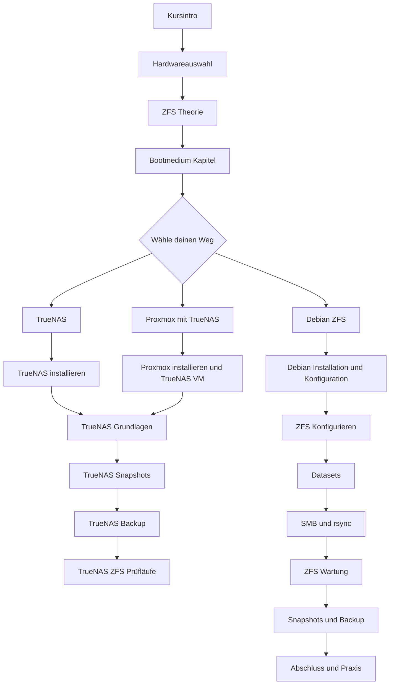
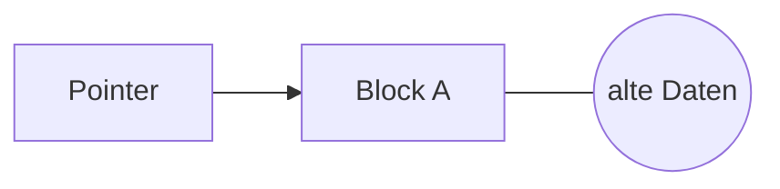
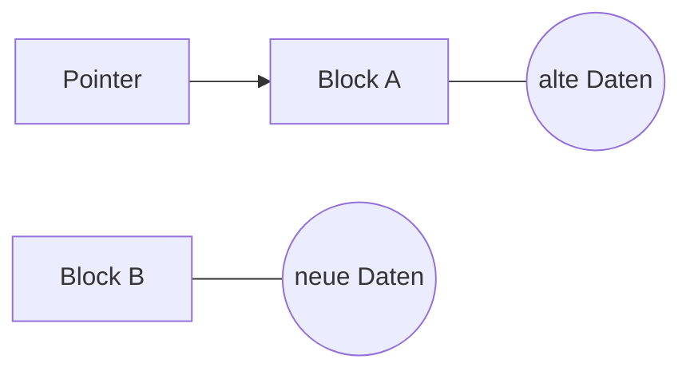
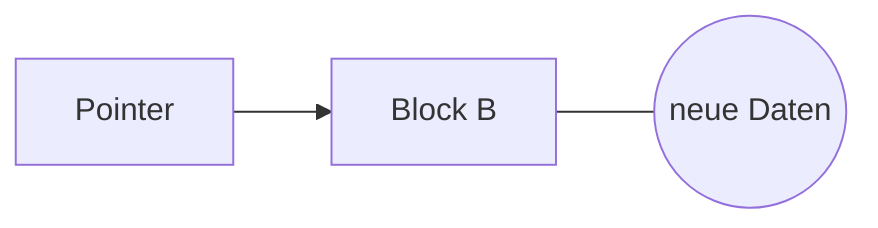
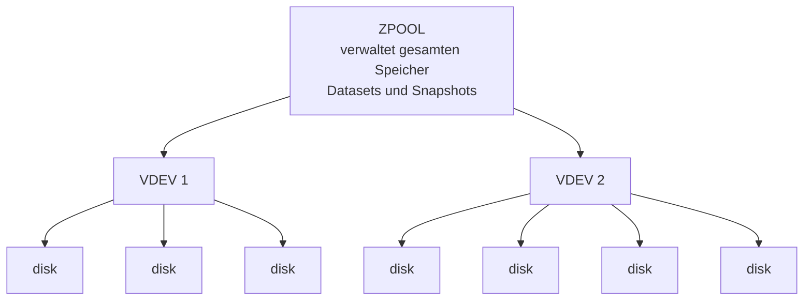
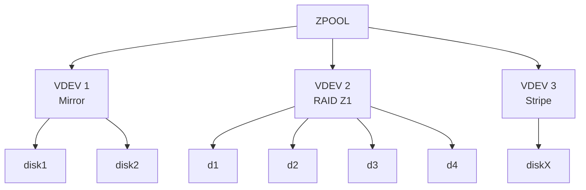

```
        _          _ ______ _____ _____ 
       |_|        | |  ____|  __ \_   _|
  _ __  ___  _____| | |__  | |  | || |  
 | '_ \| \ \/ / _ \ |  __| | |  | || |  
 | |_) | |>  <  __/ | |____| |__| || |_ 
 | .__/|_/_/\_\___|_|______|_____/_____|
 | |                                    
 |_|                                    
                             
https://links.pixeledi.eu
Handbuch und Mitschrift zum Online-Kurs Open-Source-NAS | 12.2025
```
# Open-Source NAS mit TrueNAS & Proxmox oder Debian mit ZFS:  

Hier findest du ergänzende Inhalte und Mitschrift zu meinem Online-Kurs: 

<https://www.pixeledi.eu/akademie/opensource-nas/>

---

# Inhaltsverzeichnis

- [Kursablauf](#kursablauf)
- [Hardware die ich verwende](#hardware-die-ich-verwende)
- [ZFS Basics](#zfs-basics)
- [TrueNAS direkt Installation](#truenas-direkt-installation)
- [Installation TrueNAS mit Proxmox](#installation-truenas-mit-proxmox)
- [TrueNAS direkt Installation](#truenas-direkt-installation)
- [Debian mit ZFS](#debian-mit-zfs)
- [Bonus](#bonus)

---

# Kursablauf



# hardware-die-ich-verwende

- UGREEN NASync DXP2800 2-Bay NAS: <https://amzn.to/4aoXDl2> *
- WD Red Plus 4TB NAS 3,5": <https://amzn.to/3Mz7UkJ> * 
- Nvme für System Installation: <https://amzn.to/4rywBhc> *

**Forums-Eintrag zum Thema eMMC und Systeminstallation**
ZFS Einsatz auf eMMC im UGREEN System:
[https://forums.truenas.com/t/truenas-scale-install-on-emmc-drive-in-ugreen-dxp2800/27871/15](https://forums.truenas.com/t/truenas-scale-install-on-emmc-drive-in-ugreen-dxp2800/27871/15)

## Hardware Auswahl 

Die Wahl der Hardware hat großen Einfluss auf Leistung, Lebensdauer und Sicherheit. ZFS profitiert von schnellem Speicher und zuverlässigen Controllern. Eine gute Stromversorgung und saubere Kühlung erhöhen die Stabilität. SSDs können besonders bei Metadaten und Log Dateien helfen.

## Wie viel Datenvolumen

Plane den Speicherbedarf nicht nur nach aktuellem Stand sondern mit Wachstum. ZFS eignet sich gut wenn Reserven vorhanden sind, da ein sehr voller Pool langsamer wird. Berücksichtige Snapshots, Backups und mögliche Klone.

## Wie viele gleichzeitige Clients

Die Anzahl der Clients bestimmt die Anforderungen an CPU, RAM und Netzwerkanbindung. Mehr gleichzeitige Zugriffe verlangen höhere IOPS und ausreichend Cache. In großen Umgebungen kann ein SLOG und ein schneller L2ARC helfen.

## Wie kritisch sind die Daten

Je höher der Wert der Daten, desto wichtiger ist Redundanz und Überwachung. Fehlerfreie Speicherwege, gute Backup Konzepte und regelmäßige Scrubs sind Pflicht. Ein Fehler sollte nicht zu Datenverlust führen.

## Welche Datentypen

Text, Logs und Datenbanken profitieren stark von Kompression und ARC Cache. Medien wie Fotos oder Videos wachsen schnell bringen aber oft wenig Kompressionsgewinn. Datenbanken profitieren zusätzlich von schneller Latenz.

## Welcher Einsatzbereich

Definiere ob Du ZFS für Archive, Workstations, Container Systeme, Backup Server oder Virtualisierung nutzt. Jede Umgebung stellt andere Anforderungen an Latenz, Durchsatz, Redundanz und Kapazität.

## Gleicher Hersteller und unterschiedliche Chargen

Kaufe am besten identische Modelle aber aus unterschiedlichen Produktionschargen. So senkst Du das Risiko dass mehrere Platten gleichzeitig ausfallen weil sie exakt gleich alt und gleich belastet sind. Wie man das macht?. Versuche die gleichen Typ bei unterschiedlichen Vertriebspartner zu kaufen, damit mindest du das Risiko die gleiche Charge zu erwischen. 

## Bei großen Projekten vorab mehr Festplatten kaufen

Wenn der Pool später wachsen soll ist es sinnvoll gleich mehrere passende Platten zu kaufen. So stellst Du sicher dass die Modelle noch verfügbar sind und dass die Kapazität und Leistung identisch bleibt. Wir sprechen ja von Laufzeiten in Jahren, da kann es schon vorkommen, dass ein gewisser Typ von HD/SSD nicht mehr verfügbar ist.

## RAM Nutzung und ZFS

ZFS nutzt viel RAM als Cache und für Prüfsummen. Mehr RAM sorgt meist für bessere Leistung und weniger Last auf den Platten. Ein Minimum von sechs bis sechzehn Gigabyte ist sinnvoll je nach Größe und Nutzung des Pools. Mehr RAM verbessert den ARC Cache und beschleunigt häufige Zugriffe.

# zfs-basics 

ZFS ist ein fortschrittliches Dateisystem mit integrierter Volume-Verwaltung. Es bietet dir Prüfsummen für Datenintegrität, Copy-on-Write, Snapshots, Klone und eine sehr robuste Fehlererkennung. Die Entwicklung findest du hier:

**OpenZFS Repository**
[https://github.com/openzfs/zfs](https://github.com/openzfs/zfs)
Aktuell rund 1.4k offene Issues, da das Projekt sehr aktiv ist.

**Offizielle ZFS Dokumentation**
[https://openzfs.github.io/openzfs-docs/](https://openzfs.github.io/openzfs-docs/)

## ZFS is a copyo-on-write (cow)

ZFS verwendet das Copy-on-Write-Prinzip, bei dem bestehende Datenblöcke nie direkt überschrieben werden. Wenn sich Daten ändern, schreibt ZFS sie an eine neue Position und aktualisiert erst danach die Metadaten. Dadurch bleiben alte Datenversionen erhalten, was Snapshots, Klone und eine sehr hohe Datensicherheit ermöglicht.

ZFS ist kein Ersatz für Backups, Snapshots, Clones und Mirrong auch wenn es viele Schutzmechanismen bietet:

* **Snapshots:** Sie frieren den aktuellen Datenzustand ein, schützen aber nicht vor Hardwareausfällen oder versehentlichem Löschen des gesamten Pools.
* **Clones:** Sie sind beschreibbare Kopien eines Snapshots, eignen sich für Tests, aber nicht als unabhängige Sicherung.
* **Mirroring:** Es spiegelt Daten auf mehrere Laufwerke, schützt vor Laufwerksdefekten, aber nicht vor Fehlbedienung oder Datenkorruption auf Dateisystemebene.

### COW Principles

Copy-on-Write (COW) bedeutet, dass Daten nie direkt überschrieben werden. Stattdessen werden neue Daten an eine neue Stelle geschrieben und danach die Zeiger angepasst.

Ein einfaches Beispiel:


Ist Zustand vor dem Schreiben:


Ein Pointer ist in diesem Zusammenhang ein Verweis, also eine Art „Adresse“, die zeigt, wo sich ein bestimmter Datenblock auf dem Datenträger befindet. ZFS nutzt solche Pointer, um zu wissen, an welcher Stelle die gültige Version einer Datei liegt. 


Schreibvorgan:


Erst wenn alles sicher geschrieben ist, zeigt der Pointer auf Block B:

Nachher:


So bleiben alte Daten erhalten, bis der Schreibvorgang vollständig abgeschlossen ist. Deduplizierung wird hier noch nicht erwähnt, weil sie nichts mit dem Schreibvorgang selbst zu tun hat. Copy-on-Write sorgt für Datensicherheit beim Schreiben, während Deduplizierung erst später greift, wenn gleiche Daten erkannt und zusammengeführt werden.

## ZFS – Vorteile im Überblick

* **Einfache Administration:** ZFS kombiniert Volume-Manager und Dateisystem, sodass keine zusätzliche Partitionierung oder RAID-Konfiguration nötig ist.
* **Hohe Stabilität:** ZFS ist seit vielen Jahren im produktiven Einsatz und gilt als äußerst robust und ausgereift.
* **Datenintegrität:** Durch Prüfsummen erkennt und korrigiert ZFS stille Datenfehler automatisch, was die Datensicherheit stark erhöht.
* **Skalierbarkeit:** ZFS kann sehr große Datenmengen und viele Laufwerke effizient verwalten, von kleinen Systemen bis zu Enterprise-Servern.

## ZFS – Nachteile

* **80 %-Regel:** Wenn ein Pool zu mehr als etwa 80 % gefüllt ist, sinkt die Leistung deutlich, da Copy-on-Write mehr freien Platz für neue Blöcke benötigt.
* **Unveränderliche Redundanz:** Die gewählte Redundanzstufe (z. B. RAID-Z1, Z2, Mirror) lässt sich nachträglich nicht ändern, ohne den Pool zu zerstören und neu anzulegen – ein Backup ist daher zwingend erforderlich.
* **Hoher RAM-Bedarf:** ZFS profitiert stark von viel Arbeitsspeicher, besonders bei aktivierter Deduplizierung oder großen Caches.
* **Komplexität bei Fehlern:** Reparaturen oder Wiederherstellungen erfordern fundiertes Wissen, da Fehler im Pool-Design oder in den Metadaten schwer zu beheben sind.

## Begrifflichkeiten um ZFS

**Storage Pool (Zpool):**
Der Zpool ist die zentrale Verwaltungseinheit in ZFS. Er besteht aus einem oder mehreren VDEVs (Virtual Devices), die wiederum physische Laufwerke enthalten. Der Pool bündelt alle Laufwerke zu einem großen Speicherraum, aus dem ZFS dynamisch Platz für Dateisysteme und Volumes bereitstellt. Dadurch entfällt das manuelle Partitionieren oder feste Zuweisen von Speicherplatz.

**VDEV (Virtual Device):**
Ein VDEV ist die Baueinheit eines Zpools. Es kann aus einzelnen Laufwerken (Stripe) oder aus redundanten Gruppen (Mirror, RAID-Z1, RAID-Z2, RAID-Z3) bestehen. Die Redundanz und Performance des gesamten Pools hängen direkt von der VDEV-Struktur ab. Fällt ein VDEV aus, verliert man den gesamten Pool, daher ist die Wahl der richtigen Konfiguration entscheidend.

**File System:**
Ein ZFS-Dateisystem ist ein logisches Unterverzeichnis innerhalb des Pools, das wie ein eigenes Laufwerk funktioniert. Jedes kann unabhängig komprimiert, verschlüsselt, quotiert oder mit Deduplizierung versehen werden. Änderungen am Dateisystem wirken sich nicht auf andere Datasets aus, was eine sehr flexible Verwaltung erlaubt.

**Snapshots:**
Ein Snapshot friert den Zustand eines Dateisystems zu einem bestimmten Zeitpunkt ein und ist read-only. Da ZFS Copy-on-Write nutzt, werden nur geänderte Blöcke nach dem Snapshot neu geschrieben, wodurch er sehr platzsparend ist. Snapshots sind ideal für Backups, Versionsstände oder zum schnellen Zurückrollen nach Fehlkonfigurationen.

**Clones:**
Ein Clone ist eine schreibbare Kopie eines Snapshots. Anfangs belegen Clone und Snapshot denselben Speicher, erst Änderungen am Clone erzeugen neue Datenblöcke. Clones eignen sich gut für Tests, Entwicklungsumgebungen oder das sichere Experimentieren mit Daten.

**Dataset:**
„Dataset“ ist der Oberbegriff für alle ZFS-Objekte, die Speicher im Pool nutzen – also Dateisysteme und Volumes. Jedes Dataset kann mit eigenen Eigenschaften wie Kompression, Caching, Verschlüsselung oder Deduplizierung konfiguriert werden.

**Volume (ZVOL):**
Ein Volume ist ein blockbasiertes Dataset. Es stellt sich dem System wie eine echte Festplatte dar und kann von anderen Systemen, Hypervisoren oder iSCSI-Zielen genutzt werden. Typische Einsatzgebiete sind virtuelle Maschinen oder Datenbanken, die blockorientierten Zugriff erfordern.

**Resilvering:**
Beim Resilvering wird ein Ersatzlaufwerk in einen bestehenden Pool integriert, um die Redundanz wiederherzustellen. ZFS kopiert dabei nur tatsächlich genutzte Datenblöcke (nicht die gesamte Kapazität), was den Vorgang oft deutlich schneller macht als bei klassischen RAID-Systemen. Während des Resilverings bleibt der Pool meist online, allerdings mit etwas reduzierter Leistung.

## Pool Layout

Ein ZFS-Pool (Zpool) ist die oberste Ebene in der Speicherstruktur von ZFS. Er besteht aus **einem oder mehreren VDEVs (Virtual Devices)**, die wiederum aus physischen **Festplatten oder Partitionen** zusammengesetzt sind.
Diese hierarchische Struktur bestimmt, **wie Redundanz, Performance und Kapazität** aufgebaut sind.

Man kann sich das so vorstellen:



### Erklärung:

* **ZPOOL:**
  Die oberste Verwaltungsebene. Sie bündelt alle VDEVs zu einem logischen Speicherraum.
  Aus diesem Pool werden dann **Datasets, Dateisysteme und Volumes** erstellt.

* **VDEV (Virtual Device):**
  Eine logische Gruppe von Laufwerken.
  ZFS verteilt Daten innerhalb eines VDEV je nach Redundanztyp, z. B.:

  * **Mirror:** Daten werden gespiegelt → hohe Ausfallsicherheit, halbe Kapazität.
  * **RAID-Z1 / Z2 / Z3:** Paritätsbasiert → schützt vor 1–3 Plattenausfällen.
  * **Stripe:** Keine Redundanz, aber hohe Performance.

* **Disks:**
  Physische Festplatten oder SSDs. Jede gehört genau zu einem VDEV.

Ein weiteres Beispiel mit unterschiedlichen Typen:



### Wichtig:

* **Ein Pool ist nur so sicher wie sein schwächstes VDEV.**
  Wenn ein einzelnes VDEV ausfällt, ist der gesamte Pool verloren.
* Deshalb sollte **jedes VDEV redundante Laufwerke** enthalten.
* Der Pool verwaltet automatisch, wie Daten und Metadaten auf die VDEVs verteilt werden.

Mit dieser Struktur kann ZFS flexibel wachsen – du kannst neue VDEVs hinzufügen, um mehr Kapazität oder Performance zu erreichen.

**Ashift** legt fest, wie groß die kleinste adressierbare Einheit ist, mit der ZFS Daten auf ein Laufwerk schreibt oder liest. Er muss zur physischen Blockgröße der Festplatte passen, damit Schreibvorgänge effizient sind.


## Was bedeutet ashift?

Der Wert von `ashift` ist der **Logarithmus der physischen Blockgröße** (in Byte):

| Physische Blockgröße | ashift | Erklärung  |
| ----------------- | ------ | ---------- |
| 512 B                | 9      | 2⁹ = 512   |
| 4096 B (4 K)         | 12     | 2¹² = 4096 |
| 8192 B (8 K)         | 13     | 2¹³ = 8192 |

Wenn `ashift=12`, schreibt ZFS in 4 K-Blöcken – das ist heute der Standard für moderne HDDs und SSDs.


## Warum das wichtig ist

Viele moderne Festplatten (auch WD Red) arbeiten intern mit **4 K-Sektoren**, geben sich aber nach außen als 512 B-Geräte aus (*512e*).
Wenn ZFS mit `ashift=9` (512 B) schreibt, entstehen ineffiziente **Read-Modify-Write-Zyklen**, da die physische Blockgröße größer ist als die logische.

Das führt zu:

* langsamen Schreibzugriffen
* stärkerem Verschleiß
* höherer Fragmentierung


## Beispiel mit ASCII

**Falsch (ashift=9 bei 4K-Laufwerk):**

```
Physischer Block (4K): [########]
ZFS schreibt 512B -> Platte muss erst lesen, ändern, wieder schreiben
→ langsam
```

**Richtig (ashift=12):**

```
Physischer Block (4K): [########]
ZFS schreibt direkt 4K
→ effizient und sauber ausgerichtet
```

## Prüfen der Sektorgröße

Mit `lsblk` kannst du sehen, welche physische und logische Blockgröße deine Festplatte verwendet:

```bash
lsblk -o NAME,PHY-SeC,LOG-SeC
```

Beispielausgabe:

```
NAME   PHY-SEC  LOG-SEC
sda       4096      512
sdb       4096      512
```

Das bedeutet:
Die Platte hat **physisch 4096 Bytes**, meldet aber **logisch 512 Bytes** → also **Advanced Format (512e)**.
→ Du solltest daher **ashift=12** setzen.

## Exkurs: Automatik oder manuell setzen?

ZFS erkennt den passenden `ashift`-Wert **in der Regel automatisch**, wenn du einen Pool erstellst.
Nur wenn du gezielt **tunen oder sicherstellen willst**, dass ZFS 4-K-Sektoren korrekt behandelt (z. B. bei älteren Laufwerken oder USB-Gehäusen), solltest du den Wert manuell setzen.

Das manuelle Setzen ist also **kein Muss**, sondern eine **Vorsichtsmaßnahme** oder Feineinstellung für maximale Effizienz.


## Zusammenfassung

```
+---------------------------+
|  ASHIFT = Blockgröße         |
+---------------------------+
|  Zu klein → langsamer        |
|  Zu groß  → kaum Nachteil    |
|  Optimal  → volle Leistung   |
+---------------------------+
```

**Faustregel:**
ZFS regelt das meist selbst korrekt.
Wenn du aber sicher gehen willst – nimm `ashift=12`, das passt fast immer.

## smartctl

`smartctl` ist ein Werkzeug, mit dem du den **Zustand deiner Festplatten und SSDs direkt über die S.M.A.R.T.-Daten** auslesen kannst. Diese Informationen stammen aus der Firmware des Laufwerks und zeigen, ob die Platte fehlerfrei arbeitet oder erste Anzeichen von Verschleiß oder Defekten aufweist.

Gerade bei **ZFS-Systemen** ist das wichtig, weil ZFS auf zuverlässige Laufwerke angewiesen ist. Fehlerhafte Sektoren oder schleichende Schäden erkennt ZFS zwar beim Lesen und Prüfen, aber `smartctl` hilft dir, **Probleme frühzeitig zu entdecken**, bevor Daten betroffen sind.

## Installation unter Debian

```bash
sudo apt install smartmontools
```

Danach kannst du mit einfachen Befehlen die Laufwerke prüfen:

* **Allgemeine Informationen anzeigen:**

  ```bash
  sudo smartctl -i /dev/sda
  ```
* **Gesundheitsstatus prüfen:**

  ```bash
  sudo smartctl -H /dev/sda
  ```
* **Alle Werte im Detail:**

  ```bash
  sudo smartctl -a /dev/sda
  ```

## Beispiel mit einer WD Red 2 TB

Wenn du eine WD Red im System hast, könnte die Ausgabe etwa so aussehen:

```
=== START OF INFORMATION SECTION ===
Model Family:     Western Digital Red
Device Model:     WDC WD20EXXX-68EUZN0
Serial Number:    WD-WMC4M1234567
Firmware Version: 82.00A82
User Capacity:    2,000,398,934,016 bytes [2.00 TB]
Sector Sizes:     512 bytes logical, 4096 bytes physical
Rotation Rate:    5400 rpm
SMART support is: Enabled

=== START OF READ SMART DATA SECTION ===
SMART overall-health self-assessment test result: PASSED
ID# ATTRIBUTE_NAME          VALUE WORST THRESH TYPE      UPDATED  RAW_VALUE
  1 Raw_Read_Error_Rate     200   200   051    Pre-fail  Always   0
  5 Reallocated_Sector_Ct   200   200   140    Pre-fail  Always   0
  9 Power_On_Hours          090   090   000    Old_age   Always   23456
194 Temperature_Celsius     117   102   000    Old_age   Always   33
```

## Erklärung der wichtigen Werte

* **Reallocated_Sector_Ct:** zeigt, wie viele defekte Sektoren durch Ersatzsektoren ersetzt wurden.
  → Sollte **0** sein. Steigt dieser Wert, deutet das auf eine alternde oder fehlerhafte Platte hin.

* **Power_On_Hours:** gibt die Gesamtbetriebszeit in Stunden an. WD Red-Laufwerke halten meist **40.000–60.000 Stunden** oder mehr aus.

* **Temperature_Celsius:** zeigt die aktuelle Temperatur. Werte zwischen **30–40 °C** sind ideal.

* **SMART overall-health:** zeigt, ob das Laufwerk den Selbsttest bestanden hat.
  → „**PASSED**“ bedeutet: alles in Ordnung.

## Fazit

Mit `smartctl` kannst du schnell sehen, **ob deine WD Red HDDs noch zuverlässig laufen** oder sich erste Anzeichen eines Defekts zeigen.
Gerade bei ZFS solltest du diese Werte regelmäßig prüfen, um frühzeitig ein Ersatzlaufwerk einzuplanen – bevor der Pool gefährdet ist.

Jetzt stellt man sich die Frage, warum denn `smartctl`

ZFS erkennt zwar **Datenfehler** und kann diese dank Prüfsummen auch **korrigieren**, aber es erkennt **keine physisch defekte Festplatte** – also keine Hardwareprobleme wie fehlerhafte Sektoren, defekte Köpfe oder beginnende Ausfälle.

ZFS sieht nur, **wenn Daten beim Lesen oder Schreiben nicht stimmen**, nicht aber, **warum**.
Wenn ein Laufwerk intern bereits defekte Sektoren hat oder schwächelt, kann ZFS das erst dann feststellen, **wenn betroffene Daten gelesen werden** – dann ist es oft schon zu spät.

### Unterschied in Kurzform

| Aufgabe                                      | ZFS  | smartctl |
| -------------------------------------------- | ---- | -------- |
| Prüft Datenintegrität (Checksum)             | ja   | ❌       |
| Erkennt physische Defekte                    | ❌   | ja       |
| Repariert fehlerhafte Daten aus Redundanz    | ja   | ❌       |
| Warnt frühzeitig vor Laufwerksverschleiß     | ❌   | ja       |


### Beispiel

Eine WD Red hat beginnende **Reallocated Sectors** (z. B. 5 defekte Blöcke).

* `smartctl` zeigt das sofort → du kannst die Platte rechtzeitig tauschen.
* ZFS merkt es erst, wenn diese Blöcke tatsächlich gebraucht werden – dann wird es kritisch.

### Fazit

ZFS schützt **deine Daten**, aber **nicht die Hardware**.
`smartctl` überwacht die **Gesundheit der Laufwerke** und warnt dich früh, bevor ZFS mit Fehlern reagieren muss.
Beides zusammen ergibt erst einen wirklich sicheren Speicherbetrieb.

## Deduplizierung

**Deduplizierung** bedeutet, dass identische Datenblöcke nur einmal gespeichert werden. ZFS erkennt beim Schreiben, wenn ein Block mit demselben Inhalt bereits existiert, und legt stattdessen nur einen Verweis auf den vorhandenen Block an. Dadurch spart man Speicherplatz – allerdings auf Kosten von Rechenleistung und Arbeitsspeicher.

ZFS nutzt dafür eine **Deduplication Table (DDT)**, die alle Hashes bekannter Datenblöcke speichert. Jeder neue Schreibvorgang wird gegen diese Tabelle geprüft. Ist der Hash schon vorhanden, verweist ZFS auf den bestehenden Block. Damit das funktioniert, muss die DDT möglichst im RAM bleiben, sonst wird sie auf die Festplatte ausgelagert, was die Performance drastisch verringert.

In der Praxis bedeutet das: Deduplizierung lohnt sich nur in sehr speziellen Fällen, etwa wenn viele **nahezu identische Daten** gespeichert werden – zum Beispiel:

* virtuelle Maschinen mit denselben Systemdateien
* Container-Images mit gemeinsamen Basisschichten
* große Datenarchive mit häufig wiederkehrenden Dateien

Für normale Datensammlungen, Medien, Backups oder Dokumente bringt Deduplizierung kaum Vorteil und macht das System eher langsamer. ZFS-Kompression (`compression=on`) ist in den meisten Fällen deutlich effizienter und braucht kaum zusätzliche Ressourcen.

Ein gutes Beispiel, wo Deduplizierung sinnvoll umgesetzt ist, ist **BorgBackup**. Dort wird die Deduplizierung **auf Dateiebene im Backup-Prozess** durchgeführt. Borg speichert Hashes der gesicherten Daten und erkennt beim nächsten Lauf automatisch unveränderte Blöcke. So spart man effektiv Speicherplatz und Übertragungszeit – **ohne den hohen Speicherbedarf**, den ZFS auf Dateisystemebene dafür hätte.

Kurz gesagt:
ZFS-Deduplizierung ist ein leistungsfähiges, aber anspruchsvolles Werkzeug. Man sollte sie **nur aktivieren, wenn man den Nutzen und die Systemanforderungen genau kennt**. Für klassische Backups oder Alltagsdaten ist Kompression oder ein deduplizierendes Backup-Tool wie Borg meist die bessere Wahl.

## ZFS Kompression 

ZFS komprimiert Daten automatisch beim Schreiben und entlastet dadurch Speicher und oft sogar das System, weil weniger Daten gelesen und geschrieben werden. Die Kompression passiert transparent und benötigt keine Anpassung in Programmen oder Skripten. Viele Installationen nutzen LZ4, da es sehr schnell arbeitet und in den meisten Fällen keine messbare Verlangsamung erzeugt. In vielen Szenarien gilt ZSTD inzwischen als bevorzugte Wahl, da es im Vergleich zu LZ4 meist eine bessere Rate schafft und dabei eine sehr gute Geschwindigkeit bietet. Besonders bei großen Text oder Log Dateien kann sich ZSTD deutlich lohnen, während hoch entropische Daten wie Videos nur wenig profitieren.

Du stellst die Kompression so ein:

```bash
zfs set compression=zstd tank/data
```

Wenn Du bereits einen Datensatz hast, wird alles Neue komprimiert, vorhandene Dateien ändern sich erst nach einer erneuten Speicherung oder einem Repack.

Mit diesem Befehl siehst Du die aktive Einstellung:

```bash
zfs get compression tank/data
```

Die tatsächliche Einsparung siehst Du über die Kompressionsrate:

```bash
zfs get compressratio tank/data
```

Ein Wert von zwei bedeutet zum Beispiel, dass die Datenmenge nur halb so viel Speicher benötigt. Wenn Du eine Übersicht aller Datensätze mit Kompressionsrate anzeigen willst, hilft:

```bash
zfs list
```

Die Spalte zeigt Dir dann die aktuelle Rate pro Dataset und ermöglicht einen schnellen Vergleich.

## ZFS Pool state

`sudo zpool list`

Der Befehl `sudo zpool list` zeigt eine Übersicht aller Pools und deren Zustand. Jede Spalte steht für einen wichtigen Wert.

| Spalte   | Bedeutung                                                 |
| -------- | --------------------------------------------------------- |
| NAME     | Name des Pools                                            |
| SIZE     | Gesamte nutzbare Kapazität des Pools                      |
| ALLOC    | Bereits belegter Speicher                                 |
| FREE     | Noch freier Speicher                                      |
| EXPANDSZ | Größe die noch erweitert werden kann falls Geräte wachsen |
| FRAG     | Fragmentierung im Pool in Prozent                         |
| CAP      | Aktuelle Auslastung in Prozent                            |
| DEDUP    | Faktor der Deduplizierung falls aktiviert                 |
| HEALTH   | Zustand des Pools wie ONLINE DEGRADED FAULTED             |
| ALTROOT  | Alternativer Mountpfad falls gesetzt                      |

Ein gesunder Pool zeigt HEALTH mit ONLINE und eine nicht zu hohe Fragmentierung. Ein hoher CAP Wert kann die Leistung senken.

Genauer bedeuten die Felder:

### Bedeutungen der Pool Zustände

**ONLINE**
Alles funktioniert. Alle Geräte antworten normal und der Pool ist voll nutzbar.

**DEGRADED**
Mindestens ein Gerät hat ein Problem. Der Pool arbeitet noch weiter aber mit geringerer Sicherheit oder Leistung. Du solltest schnell handeln und prüfen.

**FAULTED**
Ein Gerät oder der ganze Pool antwortet nicht korrekt. Der Pool kann nicht sicher genutzt werden. Daten können gefährdet sein.

**OFFLINE**
Ein Gerät wurde manuell oder automatisch deaktiviert. Der Pool läuft eventuell weiter je nach Redundanz. Du kannst ein Gerät wieder aktivieren.

**UNAVAIL**
Das Gerät ist nicht erreichbar und ZFS hat keinen Zugriff. Der Pool kann eventuell nicht importiert werden. Ursache kann ein fehlendes Kabel oder ein defekter Controller sein.

**REMOVED**
Ein Gerät wurde entfernt ohne sauberes Detach. ZFS hat erkannt dass es nicht mehr vorhanden ist. Der Pool kann weiterlaufen wenn Redundanz vorhanden ist.

## ZFS Pool Eigenschaften 

Mit `zpool get all data` siehst Du eine vollständige Übersicht aller Eigenschaften und Statuswerte des Pools mit dem Namen `data`. Der Befehl zeigt Dir Konfigurationsregeln, Leistungsparameter, Flags, Schutzmechanismen und Laufzeitwerte. Dazu gehören Angaben zu Blockausrichtung, automatischem Erweitern, Austausch von Geräten, Fehlerstatus, Scrub Informationen, Write Cache Verhalten, Fragmentierung und vielem mehr. Du kannst damit schnell erkennen welche Funktionen aktiv sind und ob der Pool optimal eingestellt ist.

# Installation TrueNAS mit Proxmox

**Proxmox ISO herunterladen**
[https://www.proxmox.com/de/downloads/proxmox-virtual-environment/iso](https://www.proxmox.com/de/downloads/proxmox-virtual-environment/iso)

**Bootmedium erstellen**
Nutze Etcher, um den USB Stick zu schreiben:
[https://github.com/balena-io/etcher](https://github.com/balena-io/etcher)

### ZFS RAID 1 erstellen

Wähle im Installer **ZFS RAID 1** aus.
Markiere **HD0** und **HD1**, um das Spiegel-Setup zu erstellen.

Nach der Installation:

1. In der linken Navigation **pve** auswählen.
2. **Updates** öffnen.
3. **Repositories** anklicken.
4. Beim **vorletzten Eintrag** auf *Disable* klicken.
5. Über **Add** das **No-Subscription Repository** hinzufügen.
6. Beim **letzten Eintrag** ebenfalls auf *Disable* klicken.
7. Die angezeigte Warnung kannst du ignorieren.
8. Danach **Update** ausführen.

### Erste VM erstellen

Oben rechts auf **Create VM** klicken und mit der Einrichtung beginnen.

## Exkurs TrueNAS via Proxmox installieren

TrueNAS Community ISO herunterladen.

1. In Proxmox links **local (pve)** auswählen.
2. Auf **Upload** klicken.
3. Die **TrueNAS Scale ISO** auswählen.
4. **Upload** starten.
5. Auf die Meldung **Task OK** warten.

## Neue VM erstellen

1. **Create VM** klicken.
2. Bei **Disk** als Storage **local-zfs** auswählen.
3. Größe auf **32 GB** setzen.

## PCI Controller durchreichen

Du gibst TrueNAS direkten Zugriff auf die Hardware. Dadurch bekommst du SMART Werte, volle ZFS Funktionen und hohe Stabilität. Ohne Passthrough sieht TrueNAS die Platten nur virtuell und verliert wichtige Infos.

1. In der Shell `lspci` ausführen.
2. Den SATA Controller suchen, zum Beispiel `00:14.0`.
3. In Proxmox die **VM** auswählen.
4. **Hardware** öffnen.
5. **Add** wählen.
6. **PCI Device** anklicken.
7. **Raw Device** aktivieren.
8. Den Eintrag **00:14.0** auswählen.
9. Rechts oben **Start** klicken.


# TrueNAS direkt Installation 

## Erste Schritte in TrueNAS

1. Auf die Weboberfläche zugreifen (`https://…`).
2. E-Mail eintragen.
3. Zeitzone festlegen.

## HDD verwalten

1. Links **Storage** öffnen.
2. Oben **Disks** wählen.
3. Falls Einträge vorhanden sind, diese löschen.
   Achtung: Der komplette Inhalt der HDD wird gelöscht.
4. In der Zeile das Menü öffnen und **Wipe** wählen.
5. Methode **Quick** auswählen.

Unter **Pools** sollten danach keine Einträge vorhanden sein.

## Pool erstellen

1. Links **Storage** öffnen.
2. **Create Pool** klicken.
3. Namen vergeben, zum Beispiel **HDD**.
4. Für dieses Beispiel **keine Encryption** nutzen.
5. Layout auswählen:
   * **Mirror**: Daten werden gespiegelt.
     Beispiel: 4×1 TB ergibt weiterhin 1 TB nutzbare Kapazität, aber hohe Redundanz.
   * **RAIDZ1**: Eine Platte darf ausfallen.
   * **RAIDZ2**: Zwei Platten dürfen ausfallen.
6. Für das Beispiel:
   * **Width: 2**
   * **Number of vdevs: 1**
7. Auf **Save** klicken.


## Pool exportieren und importieren

Du kannst einen Pool exportieren, um ihn in ein neues System einzubinden.

1. Zuerst **Export** nutzen.
2. Danach unter **Storage → Pools** einen **Import** durchführen, um die Funktion zu testen.

## Windows SMB Share erstellen

### Dataset anlegen

1. Links **Storage** öffnen.
2. Pool auswählen.
3. Rechts oben **Add Dataset** klicken.
4. Namen vergeben.
5. Preset **SMB** auswählen.
6. **Close** klicken.

### SMB Share hinzufügen

1. Unter dem Dataset-Dialog erscheint der **Create SMB Share** Bereich.
2. Namen vergeben.
3. **Save** klicken.
4. Im folgenden Dialog **SMB Service starten**.

Kontrolle:

1. Links **Shares** öffnen.
2. Unter **Windows SMB Shares** die drei Punkte beim Eintrag öffnen.
3. **Configure Service** wählen.
4. **NetBIOS Name** definieren.

## SMB Benutzer erstellen

1. Links **Credentials → Users** öffnen.
2. **Add** klicken.
3. Benutzername und Passwort eintragen.
4. Ganz unten **SMB User** aktivieren.
5. **Save**.

Der neue User sollte in der Übersicht sichtbar sein.

### ACL für SMB Zugriff setzen

1. Links **Shares** öffnen.
2. Beim SMB Eintrag auf das Schild-Symbol klicken (**Edit Filesystem ACL**).
3. Der neue Benutzer erscheint in der Gruppe *builtin users*.
4. Dadurch erhält er Zugriff auf SMB.

## SMB User mit eigener Gruppe

Wenn du den Benutzer aus der *builtin_users* Gruppe entfernst:

1. In **Users** den Benutzer bearbeiten.
2. Unter **Auxiliary Groups** den Eintrag entfernen.
3. **Save** drücken.

SMB Zugriff funktioniert jetzt nicht mehr, da explizite Rechte fehlen.

### Rechte neu setzen

1. Dataset auswählen.
2. **Edit ACL** öffnen.
3. **Add Item** klicken.
4. *Who*: User oder neue Gruppe wählen.
5. Benutzer auswählen.
6. Unten **Permissions: Modify** aktivieren.
7. **Save Access Control List**.

## Eigene SMB Gruppe erstellen

1. Links **Credentials → Groups** öffnen.
2. **Add** klicken.
3. Gruppenname eintragen.
4. **SMB Group** aktivieren.
5. **Save**.

Danach:

1. Gruppe öffnen.
2. Mitglieder hinzufügen.
3. Wieder zur Dataset ACL gehen und die Gruppe wie zuvor hinzufügen.

---

# Debian mit ZFS


## Sudo unter Debian aktivieren

### Als Root anmelden

```bash
su -
```

### Sudo installieren

```bash
apt install sudo
```

### Benutzer zur Sudo-Gruppe hinzufügen

```bash
usermod -aG sudo <BENUTZERNAME>
```

### Sudo Rechte prüfen oder ergänzen

```bash
visudo
```

Am Ende der Datei:

```bash
<BENUTZERNAME> ALL=(ALL:ALL) ALL
```

### Abmelden und neu anmelden

Test:

```bash
sudo apt update
```

---

## SSH Key kopieren

```bash
ssh-copy-id -i ~/.ssh/mein_key.pub pixeledi@192.168.178.101
```

---

## SSH absichern

```bash
sudo vi /etc/ssh/sshd_config
```

Folgendes aktiv setzen:

```
PermitRootLogin no
PasswordAuthentication no
```

Speichern und SSH neu starten:

```bash
sudo systemctl restart ssh
```

---

## Feste IP Adresse setzen

Quelle: [https://wiki.archlinux.org/title/Systemd-networkd](https://wiki.archlinux.org/title/Systemd-networkd)

```bash
sudo vim /etc/systemd/network/20-wired.network
```

Inhalt:

```
[Match]
Name=en*

[Network]
Address=192.168.178.220/24
Gateway=192.168.178.1
DNS=192.168.178.1
```

Aktivieren:

```bash
sudo systemctl enable systemd-networkd --now
sudo systemctl restart systemd-networkd
```

SSH Verbindung danach mit der neuen IP herstellen.

---

## Oh My Zsh installieren

Zuerst benötigte Pakete:

```bash
sudo apt install zsh git curl
```

Dann:

[https://ohmyz.sh/](https://ohmyz.sh/)

---

## Git Minimal-Konfiguration

```bash
git config --global user.name "Markus"
git config --global user.email "dein@mail"
git config --global init.defaultBranch main
```

---

## ZFS unter Debian installieren

Doku: [https://wiki.debian.org/ZFS](https://wiki.debian.org/ZFS)

```bash
sudo apt update
sudo apt install linux-headers-amd64
sudo apt install -t stable-backports zfsutils-linux
```

Falls Backports fehlen:

```bash
codename=$(lsb_release -cs);echo "deb http://deb.debian.org/debian $codename-backports main contrib non-free"|sudo tee -a /etc/apt/sources.list && sudo apt update
```

ZFS erneut installieren:

```bash
sudo apt update
sudo apt install linux-headers-amd64
sudo apt install -t stable-backports zfsutils-linux
```

---

## HDD IDs finden

```bash
ls -l /dev/disk/by-id/
```

---

## Labels löschen

```bash
sudo zpool status
sudo zpool labelclear -f /dev/sda1
sudo zpool labelclear -f /dev/sdb1
```

Oder komplett löschen:

```bash
sudo wipefs -a /dev/sda
sudo wipefs -a /dev/sdb
```

---

## Pool erstellen

### Einfacher Mirror

```bash
sudo zpool create tank mirror /dev/disk/by-id/… /dev/disk/by-id/…
```

### Mit empfohlenen Optionen

```bash
sudo zpool create -o ashift=12 \
  -O compression=lz4 \
  -O atime=off \
  -O xattr=sa \
  -O acltype=posixacl \
  -O normalization=formD \
  tank mirror \
  /dev/disk/by-id/... \
  /dev/disk/by-id/...
```

### Erklärung der wichtigsten Optionen

**ashift=12** arbeitet optimal mit 4K Sektoren.
**compression=lz4** spart Platz und IO.
**atime=off** reduziert unnötige Schreibzugriffe.
**xattr=sa** macht kleine Dateioperationen schneller.
**acltype=posixacl** bringt saubere Berechtigungen.
**normalization=formD** verhindert Probleme mit Umlauten.

---

## Pool prüfen

```bash
zpool status
sudo zpool status
sudo zfs list
```

Mountpoint anpassen:

```bash
sudo chown -R pixeledi:pixeledi /tank
```

---

## ZFS Datasets

Datasets sind eigene Dateisysteme im Pool. Damit erhältst du getrennte Einstellungen, Snapshots, Quotas und Freigaben.

### Datasets anzeigen

```bash
zfs list
zfs list -o name,mountpoint,compression,quota,used,available
```

### Dataset erstellen

```bash
sudo zfs create tank/video
```

Mit Optionen:

```bash
sudo zfs create -o compression=lz4 -o atime=off tank/backup
sudo zfs set quota=500G tank/backup
```

Mit eigenem Mountpoint:

```bash
sudo zfs create -o mountpoint=/data tank/app
```

### Dataset löschen

```bash
sudo zfs destroy tank/video
sudo zfs destroy -r tank/projects
```

### Eigenschaften anzeigen

```bash
zfs get all tank/video
zfs get compression tank/video
```

### Dataset umbenennen

```bash
sudo zfs rename tank/video tank/videos
```

### Mountpoint ändern

```bash
sudo zfs set mountpoint=/mnt/videos tank/videos
```

### Dataset vs Ordner

**Dataset**
✓ eigene Einstellungen
✓ Snapshots
✓ Quotas
✓ perfekt für SMB/NFS

**Ordner**
✗ keine separaten Einstellungen

---

## Samba Share erstellen

Dataset anlegen:

```bash
sudo zfs create -o mountpoint=/tank/data tank/data
```

Samba installieren:

```bash
sudo apt install samba
```

Freigabe aktivieren:

```bash
sudo zfs set sharesmb=on tank/data
sudo systemctl restart smbd
```

User anlegen:

```bash
sudo smbpasswd -a deinuser
```

Rechte setzen:

```bash
sudo chown -R deinuser:deinuser /tank/data
```

Windows Zugriff:

```
\\deine-ip\tank_data
```

---

## Rsync installieren

```bash
sudo apt install rsync
```

Backup Script Beispiel:

```bash
#!/bin/bash
rsync -av --delete \
  --backup \
  --backup-dir=/tank/rsync_backup \
  /home/pixeledi/Downloads/rsync_testen/ \
  pixeledi@192.168.178.225:/tank/rsync_testen
```

Simulation:

```bash
rsync -av ~/backups pixeledi@192.168.178.220:/tank/
```

---

## smartctl nutzen

Installieren:

```bash
sudo apt install smartmontools
```

Status ansehen:

```bash
systemctl status smartd
```

Laufenden Test abbrechen:

```bash
sudo smartctl -X /dev/sda
```

Neuen Test starten:

```bash
sudo smartctl -t short /dev/sda
```

Ergebnis:

```bash
sudo smartctl -l selftest /dev/sda
```

Konfiguration:

```bash
sudo nano /etc/smartd.conf
```

## Szenario: Platte offline nehmen und wieder online bringen

Eine Platte kannst du gezielt offline setzen, zum Beispiel für Wartung oder Tests.

### Platte offline setzen

```bash
sudo zpool offline tank /dev/disk/by-id/ata-WDC_WD40EFPX-68C6CN0_WD-WX72D451MU63
```

Im `zpool status` erscheint danach:

```
pool: tank
state: DEGRADED
status: One or more devices has been taken offline by the administrator.
        Sufficient replicas exist for the pool to continue functioning in a
        degraded state.
```

Der Pool läuft weiter, nutzt aber nur die verbleibende Platte.

---

### Platte wieder online bringen

```bash
sudo zpool online tank /dev/disk/by-id/ata-WDC_WD40EFPX-68C6CN0_WD-WX72D451MU63
```

ZFS startet nun automatisch ein **Resilvering**.
Dabei werden alle geänderten Blöcke auf die Platte zurückgeschrieben.

Nach Abschluss zeigt `zpool status` wieder **ONLINE**.

---

## E-Mail Benachrichtigungen einrichten (msmtp)

### Pakete installieren

```bash
sudo apt install -y msmtp msmtp-mta mailutils
```

### Konfiguration öffnen

```bash
sudo nano /etc/msmtprc
```

### Beispielkonfiguration

```
defaults
auth           on
tls            on
tls_trust_file /etc/ssl/certs/ca-certificates.crt
logfile        /var/log/msmtp.log

account        default
host           smtp.deinprovider.com
port           587
from           DEINE_EMAIL
user           DEINE_EMAIL
password       DEIN_PASSWORT
```

### Testmail

```bash
echo -e "Subject: NAS Test\n\nHallo alert" | msmtp nasalerts@sudern.de
```

### Rechte setzen

```bash
sudo chmod 644 /etc/msmtprc
```

### Prüfen ob sendmail-Link korrekt ist

```bash
ls -l /usr/sbin/sendmail
```

Sollte auf msmtp zeigen:

```
/usr/sbin/sendmail -> ../bin/msmtp
```

---

## ZFS ZED für automatische Fehler-E-Mails konfigurieren

Konfiguration öffnen:

```bash
sudo vim /etc/zfs/zed.d/zed.rc
```

Anpassen:

```
ZED_EMAIL_ADDR="alert_me@example.com"
ZED_EMAIL_PROG="mail"
ZED_EMAIL_OPTS="-s '@SUBJECT@' @ADDRESS@ -r example_sender@outlook.com"
ZED_NOTIFY_VERBOSE=1
ZED_NOTIFY_INTERVAL_SECS=0
```

Dienst neu starten:

```bash
sudo systemctl restart zfs-zed
```

---

## ZFS Pool Prüfung

Manuell einen Scrub starten:

```bash
sudo zpool scrub tank
```

Fehler werden automatisch per Mail gemeldet (wenn ZED korrekt eingerichtet ist).

---

## Datasets anlegen und verwalten

Beispiele:

```bash
sudo zfs create tank/backup
sudo zfs create tank/media
sudo zfs create tank/docker
sudo zfs create tank/tmp
```

Prüfen:

```bash
zfs list
```

Beispieleigenschaften:

```bash
sudo zfs set compression=lz4 tank/backup
sudo zfs set atime=off tank/media
```

Snapshot anlegen:

```bash
sudo zfs snapshot tank/backup@heute
```

Rollback:

```bash
sudo zfs rollback tank/backup@heute
```

Quota setzen:

```bash
sudo zfs set quota=500G tank/backup
```

Snapshot löschen:

```bash
sudo zfs destroy tank/backup@init
```

---

## Festplatte austauschen

Defekte Platte ersetzen:

```bash
sudo zpool replace tank ata-WDC_WD40EFPX-68C6CN0_WD-WX72D451MU63 /dev/sdX
```

ZFS resilvert automatisch auf die neue Platte.

---

## Snapshot-Demo

### Rechte setzen

```bash
sudo chown -R pixeledi:pixeledi /tank/backup
```

Dummy-Daten Script anlegen:

```bash
vim dummydata.sh
chmod u+x dummydata.sh
./dummydata.sh
```

### Snapshot erstellen

```bash
sudo zfs snapshot tank/backup@initial
sudo zfs list -t snapshot
```

### Clone erstellen

```bash
sudo zfs clone tank/backup@initial tank/backup_clone
```

Clone löschen:

```bash
sudo zfs destroy tank/backup_clone
```

### Dateien aus Schnappschuss kopieren (ohne Clone)

```bash
sudo cp -r /tank/backup/.zfs/snapshot/initial/linux_cli_kurs/06_invoices/ /tank/backup/linux_cli_kurs
```

---

## Sanoid – automatische Snapshots

Installieren:

```bash
sudo apt install sanoid
sudo sanoid --version
```

Config Ordner:

```bash
sudo mkdir -p /etc/sanoid/
sudo vim /etc/sanoid/sanoid.conf
```

Minimalbeispiel:

```
[tank/backup]
    use_template = daily7

[template_daily7]
    frequently = 5
    hourly = 0
    daily = 0
    weekly = 0
    monthly = 0
    yearly = 0
```

Timer prüfen:

```bash
systemctl status sanoid.timer
```

Snapshots prüfen:

```bash
zfs list -t snapshot
```

Beispiel für tägliche Snapshots (7 Stück):

```
[template_daily7]
    daily = 7
```

Debug:

```bash
sudo sanoid --verbose --readonly --debug
```

---

## BorgBackup einrichten (Hetzner Storagebox)

### SSH Key erstellen

```bash
ssh-keygen -t ed25519 -C "borgbackup"
```

Key übertragen:

```bash
ssh-copy-id -p 23 u511069@u511069.your-storagebox.de
```

Test:

```bash
ssh -p 23 u511069@u511069.your-storagebox.de
```

---

### Repo anlegen

```bash
borg init \
  --encryption=repokey-blake2 \
  ssh://u511069@u511069.your-storagebox.de:23/./borgrepo
```

---

### Backup eines Datasets erstellen

```bash
borg create \
  --compression lz4 \
  ssh://u511069@u511069.your-storagebox.de:23/./borgrepo::$(date +%F_%H-%M) \
  /tank/data
```

Repo prüfen:

```bash
borg list ssh://u511069@u511069.your-storagebox.de:23/./borgrepo
```

---

### Dateien wiederherstellen

```bash
borg extract ssh://u511069@u511069.your-storagebox.de:23/./borgbackup::2025-11-28_11-31
```

---

## Automatisiertes Backup per Cronjob

`crontab -e`:

```
30 3 * * * /home/pixeledi/borgbackup.sh
```

### borg.env

```bash
BORG_PASSPHRASE=nobackupnomercy
BORG_REPO=ssh://u511069@u511069.your-storagebox.de:23/./borgbackup
BORG_SOURCE=/tank/backup
```

### borgbackup.sh

```bash
#!/bin/bash

set -a
source /home/pixeledi/borg.env
set +a

borg create \
  --compression lz4 \
  $BORG_REPO::$(date +%F_%H-%M) \
  $BORG_SOURCE
```

---

Wenn du willst, fasse ich dir das Ganze als sauberes Kapitel für deinen Kurs zusammen.


---

# Bonus
Aktueller Content gibt es auch meinem YouTube-Kanal: <https://www.youtube.com/@pixeledi>  
Alle weiteren Links: <https://links.pixeledi.eu>  

> Alle Links mit "*" sind Amazon/Aliexpress Affiliate Links. Als Amazon-Partner verdiene ich an qualifizierten Verkäufen, Preis bleibt für euch gleich.
